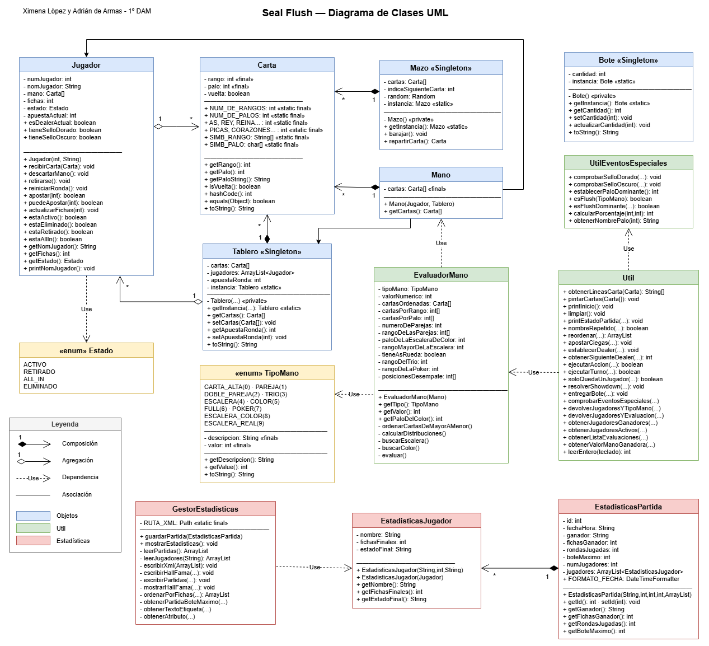

## 🦭 Seal Flush ♠️

Proyecto de Java — Juego de póker Texas Hold'em No-Limit en consola

## 👩‍💻 Autores

- [Ximena López](https://github.com/Lincex135)
- [Adrián de Armas](https://github.com/Adripan999)

## 🧾 Descripción

**Seal Flush** es una aplicación de consola en Java que implementa el juego de cartas **Texas Hold'em Poker**. El
proyecto cuenta con un menú principal navegable de tres niveles, instrucciones completas del juego, visualización de
cartas con arte ASCII en color, jerarquía de manos ilustrada y soporte para partidas de entre 2 y 10 jugadores con
nombres personalizados. La mascota del proyecto es una foca dibujada en ASCII que aparece en la pantalla de inicio junto
al logo del juego.

## ⚠️ Eventos especiales

**Seal Flush** es un juego de cartas por consola basado en las reglas del Texas Hold'em, con mecánicas originales
inspiradas en los *flushes* (color). Cada partida enfrenta a entre 2 y 6 jugadores por turnos, con apuestas, ciegas,
fases de ronda y un evaluador de manos completo.

El juego incluye **eventos especiales** exclusivos que se activan en función de las manos conseguidas:

| Evento           | Descripción                                                         |
|------------------|---------------------------------------------------------------------|
| 🥇 Sello Dorado  | Ganar con flush otorga un bono del 10% en la siguiente victoria     |
| 🌑 Sello Oscuro  | Perder con flush aplica una penalización del 10% la siguiente ronda |
| ♠ Palo Dominante | Al inicio se revela un palo que vale 50% más si hay flush           |

Las partidas y el Hall of Fame se guardan automáticamente en un archivo XML.

---

## 🎮 Cómo jugar

Al ejecutar el programa, el menú principal permite:

1. **Nueva partida** — se elige número de jugadores, nombre de cada uno y modo de juego
2. **Ver estadísticas** — muestra el historial de partidas y el Hall of Fame
3. **Ver instrucciones** — explica las reglas y la jerarquía de manos
4. **Salir**

**Modos de juego:**

- **Rondas limitadas** — se juega un número fijo de rondas; gana quien tenga más fichas al terminar
- **Sin límite** — se juega hasta que solo queda un jugador con fichas

**Fases de cada ronda:** Pre-flop → Flop (3 cartas) → Turn (4 cartas) → River (5 cartas) → Showdown

**Fichas iniciales:** 500 por jugador · Ciega pequeña: 5 · Ciega grande: 10

---

## 🗂️ Organización del código

```
src/
├── Main.java                        # Bucle principal del juego
│
├── objetos/
│   ├── Carta.java                   # Representa una carta (rango + palo)
│   ├── Mano.java                    # Combina las 2 cartas del jugador con las 5 del tablero
│   ├── Mazo.java                    # Mazo de 52 cartas (Singleton)
│   ├── Tablero.java                 # Cartas comunitarias y apuesta de ronda (Singleton)
│   ├── Bote.java                    # Fichas acumuladas en la ronda (Singleton)
│   ├── Jugador.java                 # Estado, fichas y acciones de un jugador
│   └── Estado.java                  # Enum: ACTIVO, RETIRADO, ALL_IN, ELIMINADO
│
├── util/
│   ├── Util.java                    # Lógica principal: turnos, ciegas, showdown, reordenado
│   ├── EvaluadorMano.java           # Evalúa y puntúa la mejor mano de 5 entre 7 cartas
│   ├── TipoMano.java                # Enum con valor numérico: PAREJA → ESCALERA_REAL
│   ├── UtilEventosEspeciales.java   # Lógica de activación de eventos especiales
│   ├── Instrucciones.java           # Texto de instrucciones y jerarquía de manos
│   ├── Ascii.java                   # Arte ASCII para la pantalla de inicio
│   ├── JerarquiaDeManos.java        # Visualización de la jerarquía de manos
│   └── Color.java                   # Constantes de color ANSI para la consola
│
└── estadisticas/
    ├── EstadisticasPartida.java     # Datos de una partida (ganador, fichas, rondas...)
    ├── EstadisticasJugador.java     # Datos de un jugador dentro de una partida
    └── GestorEstadisticas.java      # Lectura y escritura del XML con NIO
```

---

## 📊 Diagrama de clases UML



---

## 🔬 Investigación de funcionalidades

Funcionalidades usadas en el proyecto que van más allá del contenido visto en clase:

### 1. `clone()` en arrays

El método `clone()` se usa en `EvaluadorMano.java` para copiar el array de cartas antes de ordenarlas con el algoritmo
burbuja, protegiendo el array original.

```java
Carta[] cartasCopiadas = cartasOriginales.clone();
```

Crea un nuevo array del mismo tipo y tamaño, copiando las **referencias** a los objetos (copia superficial o *shallow
copy*), no los objetos en sí. Es seguro aquí porque la ordenación solo intercambia posiciones, sin modificar el
contenido de las cartas.

---

### 2. `SecureRandom`

`SecureRandom` es una subclase de `Random` que usa fuentes de entropía del sistema operativo para generar números
impredecibles. Se usa en `Mazo.java` para el barajado.

```java
private Random random = new SecureRandom();
```

Con `Random` estándar, alguien con acceso al código podría reproducir la secuencia si conoce la semilla. `SecureRandom`
hace esto imposible. Al declarar la variable como `Random` y asignar `SecureRandom`, se aprovecha el polimorfismo: el
resto del código usa los métodos de `Random` sin saber qué implementación hay por debajo.

---

### 3. `StringBuilder`

Permite construir cadenas de texto de forma eficiente en bucles, sin crear objetos `String` intermedios (que en Java son
inmutables).

```java
StringBuilder sb = new StringBuilder();
sb.append(todasLinea[fila]);
sb.append("  ");
System.out.println(sb);
```

Se usa en `Util.java` y `Tablero.java` para montar la representación visual de las cartas línea a línea. Usar
`String +=` en un bucle crearía un objeto nuevo en cada iteración; `StringBuilder` reutiliza el mismo buffer interno
hasta llamar a `toString()`.

---

### 4. Algoritmo de Fisher-Yates

Algoritmo de barajado que garantiza que todas las permutaciones posibles tienen la misma probabilidad. Implementado en
`Mazo.java`, método `barajar()`.

```java
for(int i = 0; i < NUM_DE_CARTAS; i++) {
    int j = random.nextInt(NUM_DE_CARTAS);
    Carta temp = cartas[i];
    cartas[i]=cartas[j];
    cartas[j]=temp;
}
```

En cada iteración se intercambia la carta actual con una posición aleatoria del mazo completo. El intercambio usa la
variable temporal `temp`, patrón clásico de *swap* en Java al no existir operador directo.

---

### 5. Algoritmo de ordenación burbuja (*Bubble Sort*)

Implementado en `EvaluadorMano.java` para ordenar las 7 cartas de mayor a menor rango antes de evaluar la mano.

```java
for(int vuelta = 0; vuelta < cartas.length -1; vuelta++){
    for(int pos = 0; pos < cartas.length -1 -vuelta; pos++){
        if(cartas[pos].getRango() <cartas[pos +1].getRango()){
            Carta temp = cartas[pos];
            cartas[pos]=cartas[pos +1];
            cartas[pos +1]=temp;
        }
    }
}
```

Con cada pasada completa el elemento mayor queda colocado al final; el límite interior se reduce en uno cada vuelta
porque esa parte ya está ordenada. Para 7 cartas la complejidad O(n²) es completamente irrelevante en rendimiento.

---

### 6. `ProcessBuilder`

Permite lanzar procesos del sistema operativo desde Java. Se usa en `Util.java` para limpiar la consola entre turnos.

```java
new ProcessBuilder("cmd","/c","cls").inheritIO().start().waitFor();
```

- `inheritIO()` conecta la entrada/salida del proceso hijo con la de Java, para que el resultado aparezca en la misma
  consola
- `waitFor()` bloquea Java hasta que el proceso termina
- El método detecta el sistema operativo con `System.getProperty("os.name")` para usar `cls` en Windows o `clear` en
  Linux/macOS. Si falla, usa el código de escape ANSI `\033[H\033[2J` como alternativa

---

### 7. NIO (`java.nio.file`) para lectura y escritura de XML

El paquete `java.nio.file` (New I/O) ofrece una API moderna para trabajar con archivos. Se usa en
`GestorEstadisticas.java` para persistir las estadísticas.

```java
Path ruta = Paths.get("../datos", "estadisticas.xml");
Files.createDirectories(ruta.getParent());
Files.writeString(ruta, contenidoXml, StandardOpenOption.CREATE,
                  StandardOpenOption.TRUNCATE_EXISTING);

String contenido = Files.readString(ruta);
```

- `Paths.get()` construye la ruta de forma independiente al sistema operativo
- `Files.createDirectories()` crea la carpeta si no existe
- `Files.writeString()` y `Files.readString()` trabajan directamente con `String`, sin necesidad de gestionar streams
  manualmente

El archivo XML se escribe y lee manualmente como texto usando `StringBuilder` y búsqueda de etiquetas, sin librerías
externas de parseo XML.

---

### 8. `enum` con atributos y métodos

`TipoMano` es un enumerado avanzado: cada constante tiene su propia descripción en español y un valor numérico que
permite comparar manos directamente.

```java
public enum TipoMano {
    CARTA_ALTA("Carta alta", 0),
    ESCALERA_REAL("Escalera real", 9);

    private final String descripcion;
    private final int valor;

    TipoMano(String descripcion, int valor) { ...}

    @Override
    public String toString() {
        return descripcion;
    }
}
```

Al sobreescribir `toString()`, al imprimir un `TipoMano` aparece `"Escalera real"` en vez de `"ESCALERA_REAL"`. El valor
numérico permite determinar la mano ganadora sin `switch` ni cadenas de `if-else`.

---

### 9. Códigos de escape ANSI para color en consola

Los terminales modernos interpretan secuencias de escape ANSI para aplicar colores y estilos al texto. Se encapsulan en `Color.java` como constantes `String` estáticas, lo que permite usarlas en cualquier `System.out.println()` sin importar nada.

```java
public static final String RED    = "\u001B[31m";
public static final String GREEN  = "\u001B[38;2;98;255;60m";
public static final String PURPLE = "\u001B[38;5;54m";
public static final String PINK   = "\u001B[38;5;211m";

public static final String LIGHT_YELLOW_BG = "\u001B[48;5;230m";
public static final String RESET           = "\u001B[0m";
```

Todas las secuencias empiezan con `\u001B[` (ESC + `[`) y terminan con `m`. El código que va en medio determina el efecto:

- **Colores estándar** (`\u001B[31m` → rojo): la paleta básica de 8/16 colores, compatible con cualquier terminal
- **Paleta de 256 colores** (`\u001B[38;5;NNm`): `38;5;` indica color de texto extendido, seguido del índice (0–255). Se usa para el rosa (`211`) o el morado (`54`), que no existen en la paleta básica
- **Color RGB directo** (`\u001B[38;2;R;G;Bm`): `38;2;` activa el modo *truecolor* con los tres canales. Se usa en el verde personalizado (`98;255;60`) y en algunos fondos. Requiere un terminal compatible con truecolor (la mayoría de los actuales lo son)
- **Color de fondo**: el mismo esquema pero con `48` en vez de `38` (`\u001B[48;5;230m` → fondo amarillo claro para las cartas)
- **`RESET`** (`\u001B[0m`): restaura todos los atributos al valor por defecto. Es imprescindible cerrarlo tras cada fragmento coloreado, o el color se propaga al texto siguiente

```java
System.out.println(Color.RED + "ERROR. Entrada no válida" + Color.RESET);
```

---

## 📁 Formato del archivo XML

Las estadísticas se guardan en `estadisticas/sealFlush.xml` con esta estructura:

```
sealFlush
└── hallOfFama
    └── entrada (id, fecha, ganador)
└── hallOfFama
    └── jugadores (id, fecha, ganador)
        └── jugador (nombre, fichasFinales, estadoFinal)
```

---

## 🗣️ Disclaimer

This was us during the proyect btw
<p align="center">
  
</p>

## 📚 Bibliografía

- [API Java 21 — Oracle](https://docs.oracle.com/en/java/se/21/docs/api/)
- [SecureRandom — Java Docs](https://docs.oracle.com/en/java/se/21/docs/api/java.base/java/security/SecureRandom.html)
- [Algoritmo Fisher-Yates — Wikipedia](https://es.wikipedia.org/wiki/Algoritmo_de_Fisher-Yates)
- [java.nio.file — Oracle Docs](https://docs.oracle.com/en/java/se/21/docs/api/java.base/java/nio/file/package-summary.html)
- [ProcessBuilder — Java Docs](https://docs.oracle.com/en/java/se/21/docs/api/java.base/lang/ProcessBuilder.html)
- Apuntes de Programación — Alberto Ruiz, 1º DAM
